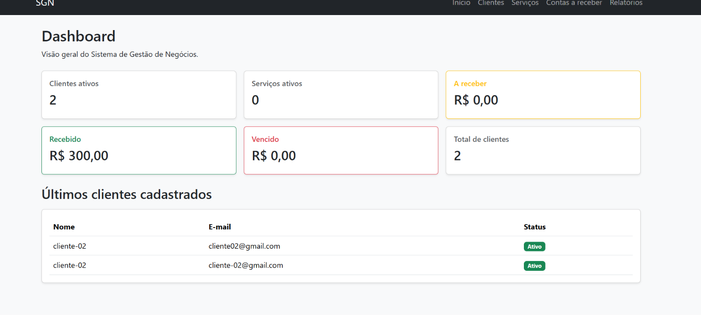
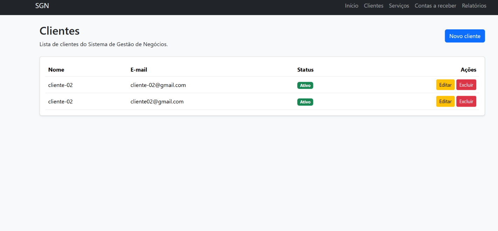
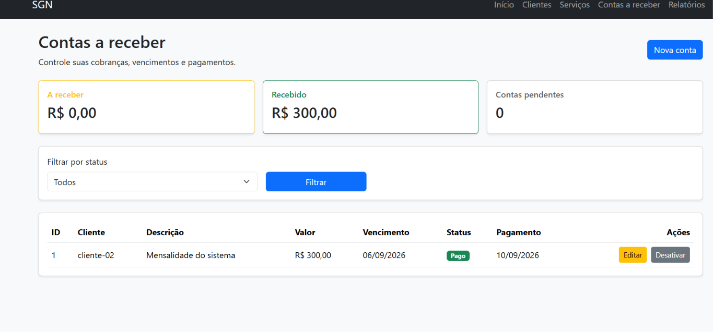

# SGN — Sistema de Gestão de Negócios

Sistema web desenvolvido com **PHP e Laravel** para gerenciamento de pequenos negócios, reunindo controle de clientes, serviços, contas a receber e informações financeiras em uma única aplicação.

Este projeto foi desenvolvido como parte do meu portfólio profissional, aplicando conceitos de desenvolvimento back-end, arquitetura MVC, banco de dados e regras de negócio.

## 🚀 Funcionalidades

* Dashboard com indicadores financeiros
* Cadastro e gerenciamento de clientes
* Cadastro e gerenciamento de serviços
* Controle de contas a receber
* Controle de pagamentos
* Status de contas: Pendente, Pago e Cancelado
* Ativação e desativação de registros
* Filtros de contas por status
* Relatórios financeiros por período e situação
* Interface responsiva para diferentes tamanhos de tela

## 📊 Dashboard

O dashboard apresenta uma visão geral do negócio através dos seguintes indicadores:

* Clientes ativos
* Serviços ativos
* Total a receber
* Total recebido
* Total vencido
* Total de clientes
* Últimos clientes cadastrados

### Tela do Dashboard


## 🧩 Módulos

### Clientes
Permite cadastrar, visualizar, editar e gerenciar os clientes do sistema.

#### Tela de Clientes


### Serviços
Permite registrar serviços vinculados aos clientes, incluindo descrição, valor, data, situação e status.

### Contas a receber

Permite controlar cobranças, valores, vencimentos, pagamentos e situação das contas.

#### Tela de Contas a Receber



### Relatórios


Permite consultar as informações financeiras utilizando filtros por período e status das cobranças.

## 🛠️ Tecnologias

* PHP
* Laravel
* MySQL
* Blade
* HTML5
* CSS3
* Bootstrap
* Git
* GitHub

## 🏗️ Arquitetura

O projeto utiliza o padrão **MVC (Model-View-Controller)** disponibilizado pelo Laravel.

* **Models** — acesso e manipulação dos dados
* **Views** — interface desenvolvida com Blade e Bootstrap
* **Controllers** — regras e fluxo da aplicação
* **Routes** — definição das rotas e endpoints do sistema
* **Migrations** — versionamento da estrutura do banco de dados

## 💻 Instalação

Clone o repositório:

```bash
git clone https://github.com/riclaudiosr/sgn-laravel.git
```

Entre no diretório:

```bash
cd sgn-laravel
```

Instale as dependências:

```bash
composer install
```

Crie o arquivo `.env` a partir do `.env.example`.

Gere a chave da aplicação:

```bash
php artisan key:generate
```

Configure a conexão com o MySQL no arquivo `.env`.

Exemplo:

```env
DB_CONNECTION=mysql
DB_HOST=127.0.0.1
DB_PORT=3306
DB_DATABASE=sgn
DB_USERNAME=root
DB_PASSWORD=
```

Execute as migrations:

```bash
php artisan migrate
```

Inicie o servidor de desenvolvimento:

```bash
php artisan serve
```

A aplicação ficará disponível normalmente em:

```text
http://127.0.0.1:8000
```

## 📚 Conhecimentos aplicados

Durante o desenvolvimento deste projeto foram aplicados conceitos como:

* Desenvolvimento back-end com PHP
* Framework Laravel
* Programação orientada a objetos
* Arquitetura MVC
* CRUD
* Relacionamentos entre Models
* Eloquent ORM
* Validação de formulários
* Migrations
* Blade Templates
* Banco de dados MySQL
* Interface responsiva com Bootstrap
* Controle de versão com Git
* Versionamento de código com GitHub

## 🎯 Objetivo

O SGN foi desenvolvido como projeto de portfólio para demonstrar, na prática, conhecimentos em **PHP, Laravel, MySQL e desenvolvimento web back-end**.

O projeto busca simular necessidades encontradas em sistemas administrativos reais, incluindo gerenciamento de clientes, prestação de serviços, cobranças e acompanhamento financeiro.

## 👨‍💻 Autor

**Riclaudio Rodrigues**

Desenvolvedor PHP Júnior | Back-end
PHP | Laravel | MySQL | MVC | POO | Git | GitHub
